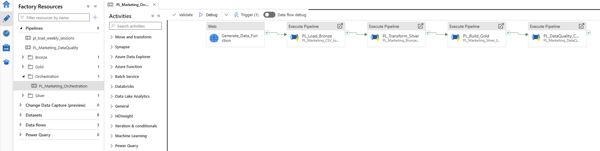
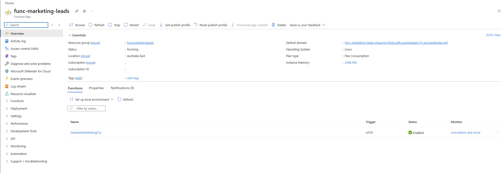
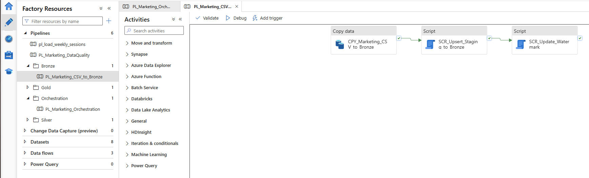
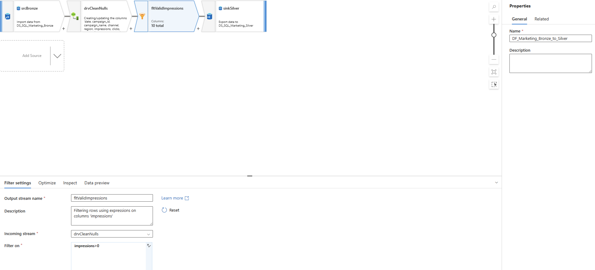
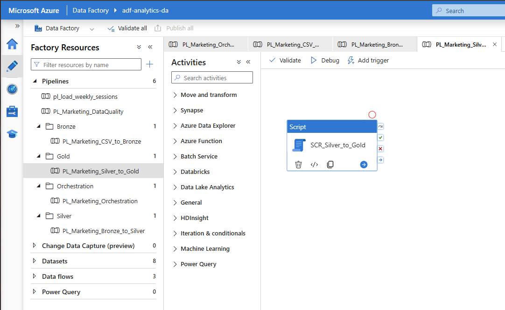
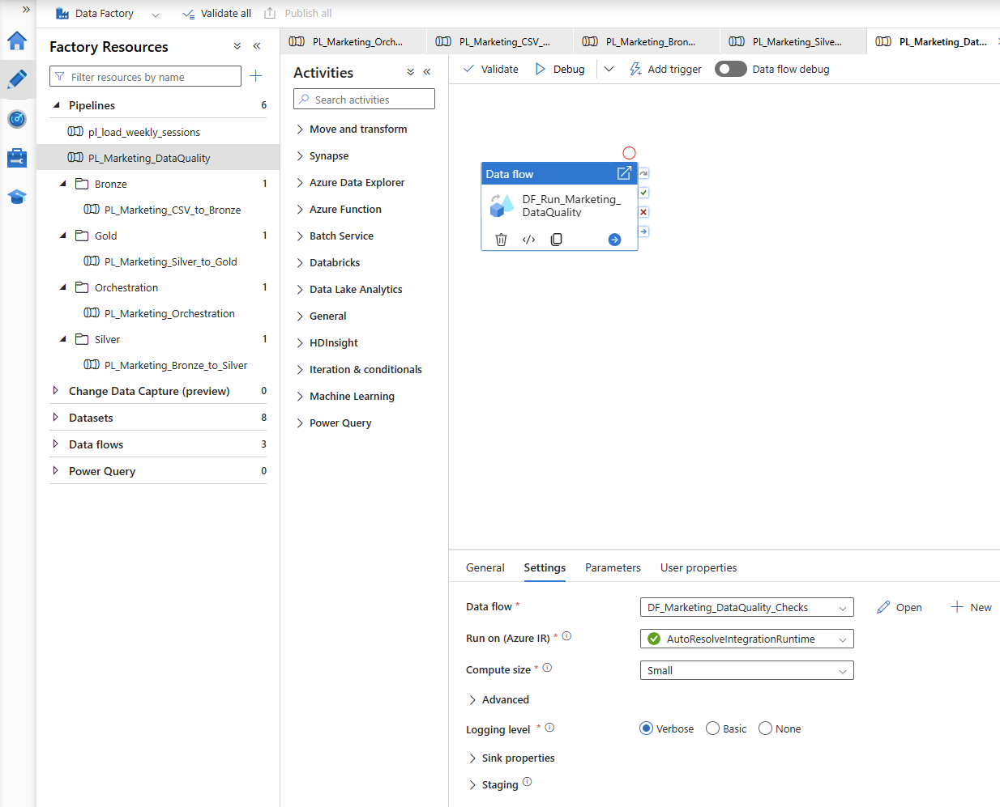
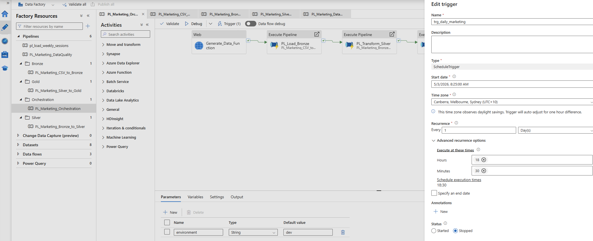

# Marketing Data Pipeline (Azure)

End-to-end cloud-based marketing data pipeline built using Azure Data Factory, Azure Functions, Azure Blob Storage, and Azure SQL Database.

This project implements a modern Medallion Architecture (Bronze, Silver, Gold) with automated data generation, orchestration, incremental processing, UPSERT logic, and data quality monitoring.

---

# 📸 Architecture Overview

## 📸 Master Pipeline

Master pipeline orchestrating the complete end-to-end workflow:



---

## 📸 Azure Function Trigger

Azure Function automatically generating marketing CSV files and saving them into Blob Storage:



---

## 📸 Bronze Layer

Raw ingestion layer storing source data from Blob Storage:



---

## 📸 Silver Transformation

Data cleaning and standardization process:



---

## 📸 Gold KPIs

Business KPI calculations and analytics layer:



---

## 📸 Data Quality Monitoring

Data quality validation and issue detection:



---

## 📸 Pipeline Trigger Schedule

ADF trigger configured to run the pipeline automatically on a schedule:



---

# 🚀 Project Overview

This project demonstrates how to build a scalable and production-style marketing analytics pipeline using Azure cloud services.

The solution automates the complete workflow:

1. Azure Function generates marketing campaign data
2. CSV files are automatically saved into Azure Blob Storage
3. Azure Data Factory orchestrates the pipeline execution
4. Data is processed through Bronze, Silver, and Gold layers
5. Data quality validations identify problematic records
6. Business KPIs are generated for reporting and analytics

The architecture simulates a real-world cloud data engineering environment using serverless components and orchestration.

---

# 🏗 Solution Architecture

## 🔹 Azure Function (Data Generation Layer)

A Python-based Azure Function generates synthetic marketing campaign data and uploads CSV files directly into Azure Blob Storage.

Key features:

* Serverless execution
* Automated CSV generation
* Blob Storage integration
* Cloud deployment using Azure Functions
* Triggered through Azure Data Factory Web Activity

---

## 🥉 Bronze Layer (Raw Data)

The Bronze layer stores raw source data exactly as received from Blob Storage.

Characteristics:

* No business transformations
* Preserves source fidelity
* Stores ingestion-ready raw records
* Acts as the single source of truth

---

## 🥈 Silver Layer (Cleaned & Standardized Data)

The Silver layer applies business cleaning rules and standardization logic.

Transformations include:

* Missing campaign names replaced with:

  * `Unknown`
* Missing numeric values replaced with:

  * `0`
* Invalid records filtered:

  * `impressions > 0`
* Data standardization and validation

This layer improves data consistency and analytical reliability.

---

## 🥇 Gold Layer (Business Analytics)

The Gold layer generates analytical KPIs used for reporting and business insights.

Calculated metrics:

* CTR (Click Through Rate)
* Conversion Rate
* CPA (Cost per Acquisition)
* ROAS (Return on Ad Spend)
* Profit (Revenue - Cost)

This layer is optimized for analytics and reporting consumption.

---

## ⚠️ Data Quality Layer

The pipeline includes dedicated data quality monitoring.

Detected issues include:

* Missing campaign name
* Zero impressions
* Zero cost
* Missing revenue
* Conversions greater than clicks

Each issue is logged with:

* Issue date
* Issue type
* Description
* Source record information

---

# 🔄 Pipeline Orchestration Flow

The complete workflow is orchestrated through Azure Data Factory.

Pipeline flow:

1. ADF Trigger starts the pipeline
2. Web Activity calls Azure Function
3. Azure Function generates CSV file
4. CSV file is saved into Azure Blob Storage
5. Blob → Staging ingestion
6. Staging → Bronze UPSERT process
7. Bronze → Silver transformation
8. Silver → Gold KPI generation
9. Data Quality validation process

---

# 🔁 Incremental Load & UPSERT Logic

The pipeline implements incremental processing using MERGE (UPSERT) logic.

Business key:

* campaign_id
* date
* region

UPSERT behavior:

* Existing records are updated
* New records are inserted
* Duplicate records are prevented

This approach simulates real-world enterprise incremental loading strategies.

---

# ☁️ Cloud Components Used

## Azure Data Factory

Used for:

* Pipeline orchestration
* Scheduling
* Web activity integration
* Data movement
* Data Flow transformations

---

## Azure Functions

Used for:

* Serverless Python execution
* Automated CSV generation
* Blob Storage integration

---

## Azure Blob Storage

Used for:

* Landing zone for CSV files
* Raw file storage
* Integration between services

---

## Azure SQL Database

Used for:

* Bronze / Silver / Gold storage
* Data quality tables
* Incremental processing
* MERGE operations

---

# 🛠 Technologies Used

* Azure Data Factory (ADF)
* Azure Functions
* Azure Blob Storage
* Azure SQL Database
* Python
* SQL
* Data Flow transformations
* Medallion Architecture
* MERGE / UPSERT logic
* Incremental processing

---

# 📈 Business Value

This pipeline demonstrates several important data engineering concepts used in production systems:

* Automated cloud orchestration
* Serverless architecture
* Layered Medallion Architecture
* Incremental processing
* Data quality monitoring
* Reliable KPI generation
* End-to-end pipeline automation
* Scalable cloud-based ingestion patterns

---

# 💡 Key Engineering Concepts Demonstrated

* Cloud-native data pipelines
* Serverless computing
* Data orchestration
* Incremental load strategies
* UPSERT / MERGE processing
* ETL / ELT concepts
* Data validation
* Analytics-ready transformations
* Production-style architecture patterns

---

# 📂 Project Structure

```text
marketing-data-pipeline-azure/
│
├── screenshots/
├── azure-function/
├── adf-pipelines/
├── sql/
├── sample-data/
└── README.md
```

---

# 🚀 Future Improvements

Potential future enhancements:

* CI/CD deployment pipeline
* Event-based Blob triggers
* Monitoring & alerting
* Power BI dashboard integration
* Delta Lake implementation
* Parameterized pipeline execution
* Infrastructure as Code (Terraform/Bicep)

---

# 👩‍💻 Author

Daniela Macena
Data Engineer Projects

LinkedIn:
[https://linkedin.com/in/danielamacena](https://linkedin.com/in/danielamacena)
