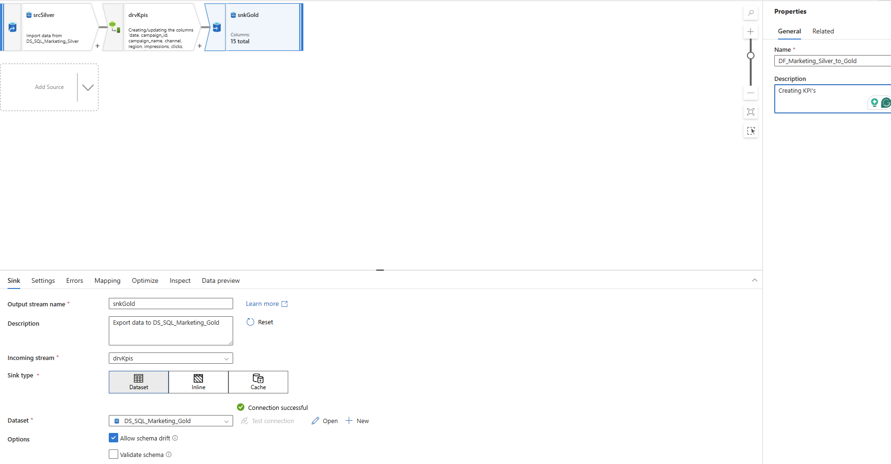

# Marketing Data Pipeline (Azure)

End-to-end marketing data pipeline built using Azure Data Factory, implementing a Medallion Architecture (Bronze, Silver, Gold) with data quality monitoring.

---

## 📸 Pipeline Overview

Master pipeline orchestrating the full data flow:

## 📸 Silver Transformation

## 📸 Gold KPIs

## 📸 Data Quality

---

## 🚀 Overview

This project demonstrates how to build a scalable and reliable data pipeline for marketing analytics.

The pipeline:

- Ingests raw CSV data into the Bronze layer
- Cleans and standardizes data in the Silver layer
- Generates business KPIs in the Gold layer
- Detects data quality issues for monitoring and validation

---

## 🏗 Architecture

### 🥉 Bronze Layer (Raw Data)

- Stores raw data from CSV ingestion
- No transformations applied
- Acts as the single source of truth

---

### 🥈 Silver Layer (Cleaned Data)

- Handles missing values:
  - `campaign_name → 'Unknown'`
  - `cost / revenue → 0`
- Filters invalid records:
  - `impressions > 0`
- Ensures consistent and reliable data

---

### 🥇 Gold Layer (Business KPIs)

Creates analytical metrics:

- CTR (Click Through Rate)
- Conversion Rate
- CPA (Cost per Acquisition)
- ROAS (Return on Ad Spend)
- Profit (Revenue - Cost)

---

### ⚠️ Data Quality Layer

Detects problematic records such as:

- Missing campaign name
- Zero impressions
- Zero cost
- Conversions greater than clicks
- Missing revenue

Each issue is stored with:

- Issue date
- Issue type
- Issue description

---

## 🔄 Pipeline Flow

1. CSV → Bronze (raw ingestion)
2. Bronze → Silver (data cleaning & validation)
3. Silver → Gold (KPI calculation)
4. Data Quality checks (issue detection)

---

## 🛠 Technologies Used

- Azure Data Factory (ADF)
- Azure SQL Database
- Data Flow transformations
- Medallion Architecture (Bronze / Silver / Gold)

---

## 📈 Business Impact

- Ensures accurate marketing performance reporting
- Prevents incorrect KPI calculations caused by bad data
- Improves trust in analytics and decision-making
- Enables scalable and reusable data pipelines

---

## 📂 Project Structure
